# LLVM Analysis Visualization Report

Generated on 2025-11-10 03:08:44 UTC
(Artifacts rooted at `./`)

## Level 1

- CFG diagrams: 2
- Liveness visuals: 2
- CCT captures: 1

### Control-Flow Graphs
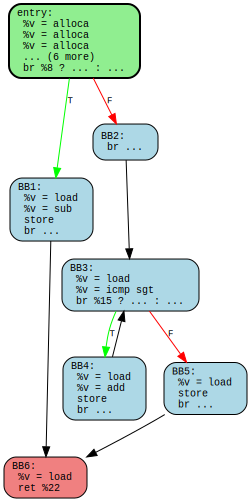

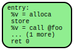

### Liveness Heatmaps
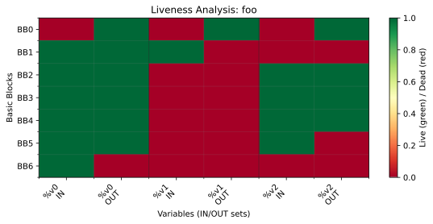

### Live Range Charts
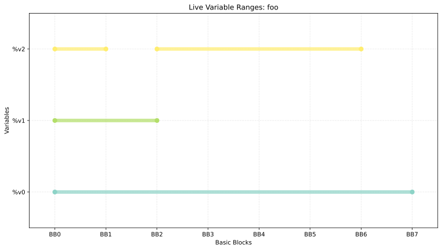

### Calling Context Trees
#### calls_cct.txt
```
r=3
=== Calling Context Tree ===
main [1]
  bar [1]
    baz [1]
```


## Level 2

- CFG diagrams: 8
- Liveness visuals: 12
- CCT captures: 1

### Control-Flow Graphs
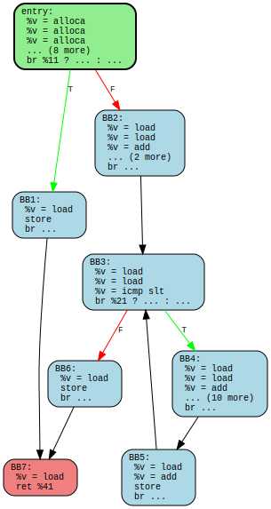

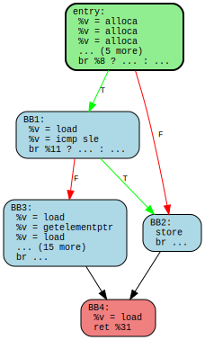

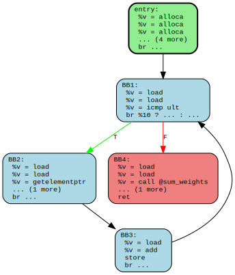

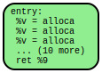

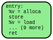

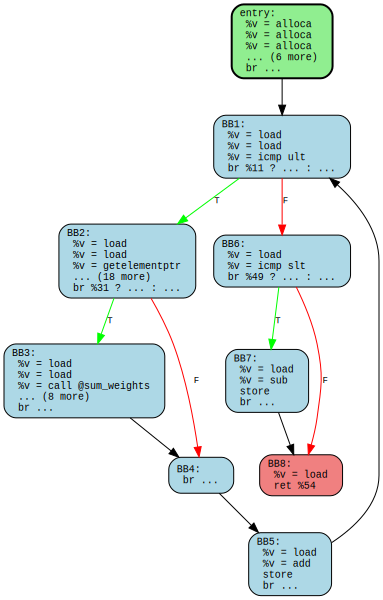

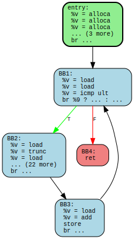

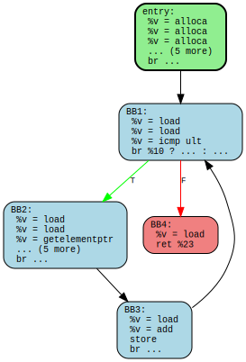

### Liveness Heatmaps
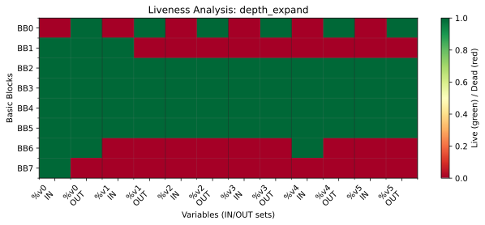

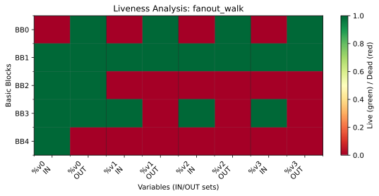

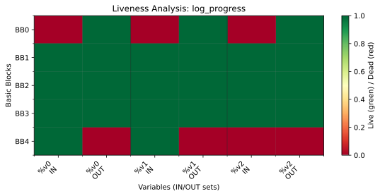

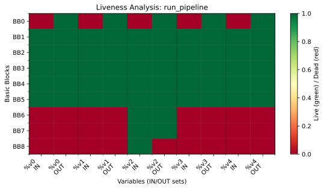

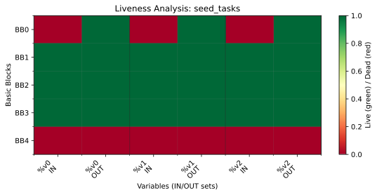

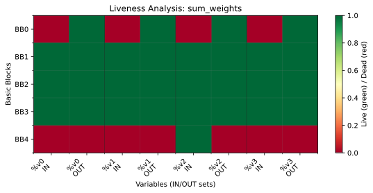

### Live Range Charts
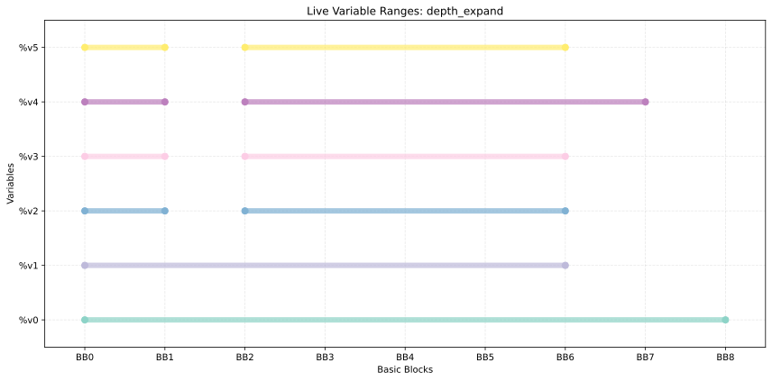

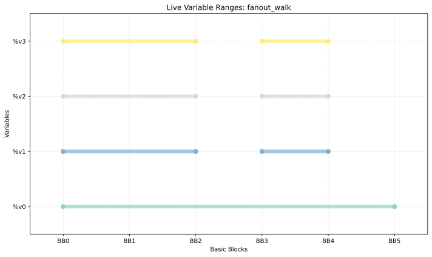

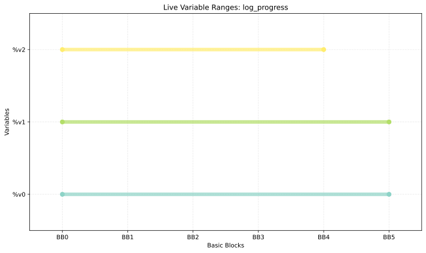

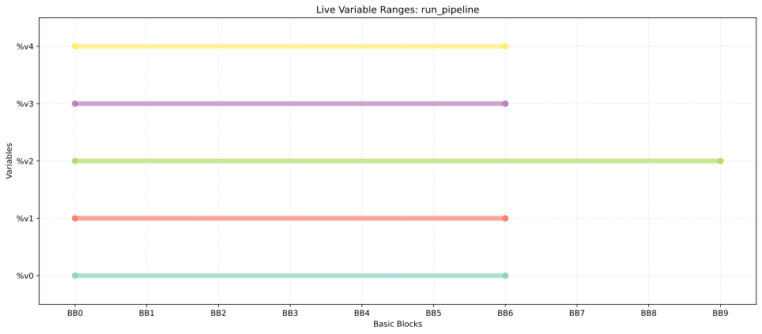

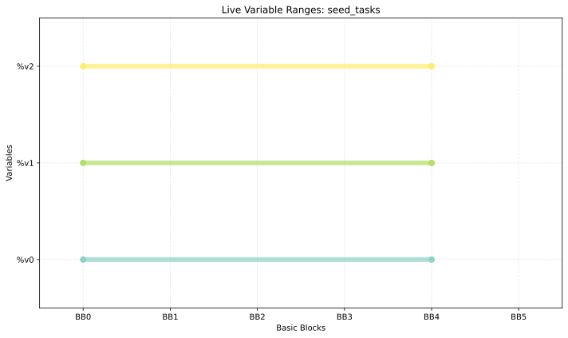

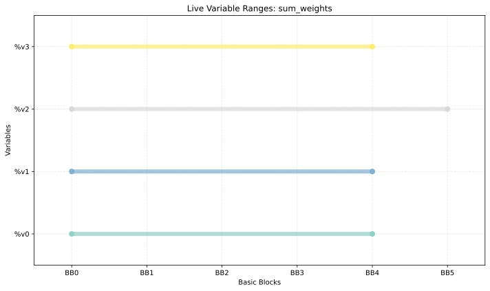

### Calling Context Trees
#### level2_cct.txt
```
-- progress snapshot --
task #0 weight=5 fanout=2
task #1 weight=8 fanout=3
task #2 weight=11 fanout=4
task #3 weight=14 fanout=5
task #4 weight=17 fanout=2
total weight=55
=== Calling Context Tree ===
main [1]
  seed_tasks [1]
  run_pipeline [1]
    sum_weights [3]
    fanout_walk [5]
      depth_expand [5]
        depth_expand [16]
          depth_expand [39]
            depth_expand [78]
              depth_expand [108]
                depth_expand [120]
  log_progress [1]
    sum_weights [1]
    print_task [5]
```


